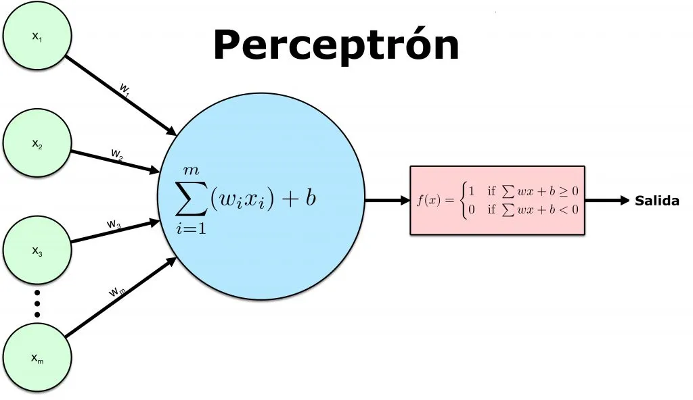

# Proyecto Carro Autónomo

# Perceptrón

El perceptrón es como una **neurona artificial individual**:
Se usa para **clasificación binaria**: decidir entre dos clases (ejemplo: ¿hay obstáculo sí/no?).

- Toma varias **entradas** numéricas.
- Cada entrada se multiplica por un **peso** ($w_i$), que indica su importancia.
- Calcula una **suma ponderada** de sus entradas ($z = w_1 x_1 + w_2 x_2 + \cdots + w_n x_n = \mathbf{x}^\intercal \mathbf{w}$).
- A esta suma se le añade un **sesgo** ($b$), que es un valor adicional que facilita que el perceptrón emita una salida de 1 si el sesgo es grande y positivo, o un 0 si es muy negativo.
- Finalmente, aplica una **función escalón** (o función de activación) a la suma ponderada más el sesgo para producir una **salida binaria** (0 o 1). La función escalón de Heaviside es un ejemplo común.

## **Del Perceptrón a las Redes Neuronales Artificiales y el Deep Learning**

- **Redes Neuronales Artificiales (ANN)**: Una ANN es una colección de perceptrones y funciones de activación conectados entre sí, organizados en capas ocultas o unidades. La idea central del conexionismo es que un gran número de unidades computacionales simples pueden lograr un comportamiento inteligente cuando se conectan en red.
- **Deep Learning y Redes Neuronales Profundas (DNN)**: Cuando una ANN contiene una pila "profunda" de capas ocultas, se le denomina Red Neuronal Profunda (DNN).

### **Conceptos Fundamentales Clave en la Evolución:**

- **Pesos y Sesgos**: La capacidad de la red para aprender reside en ajustar la fuerza de las conexiones (pesos) y los sesgos durante el entrenamiento.
    - Los pesos ($w$): Los pesos **moderan las señales entrantes** en un nodo. Un peso bajo restará importancia a una señal, mientras que un peso alto la amplificará.
    - Sesgo ($b$): El sesgo funciona como un **ajuste flexible** que permite que la neurona tome mejores decisiones.
- **Funciones de Activación**: Las **funciones de activación** son componentes matemáticos que permiten que una red neuronal aprenda **relaciones no lineales** entre entradas y salidas.
    - Lineal → $f(x)=x$
        - La salida es igual a la entrada.
        - Útil en problemas de **regresión** (valores continuos).
        - Limitada: no permite modelar relaciones no lineales.
    - **Sigmoide (Logística) → $\large f(x)= \frac{1}{1 + e^{-x} }$**
        - Salida entre **0 y 1**.
        - Buena para problemas de **clasificación binaria**.
        - Problema: saturación en valores extremos → gradientes pequeños (difícil de entrenar).
    - Tangente hiperbólica (tanh) → $f(x)=tanh(x)$
        - Salida entre -**1 y 1**.
        - Centrada en 0 (mejor que la sigmoide en algunos casos).
        - También sufre saturación en valores extremos.
    - ReLU (Rectified Linear Unit) → $f(x)=max(0,x)$
        - Muy usada en redes profundas.
        - Mantiene valores positivos, bloquea negativos.
        - Problema: algunas neuronas pueden quedar “muertas” si siempre reciben valores negativos.

| Función | Fórmula | Rango salida | Ventajas | Limitaciones | Usos típicos |
| --- | --- | --- | --- | --- | --- |
| **Lineal** | $f(x)=x$ | (-∞, ∞) | Simple, útil en regresión | No modela no linealidad | Problemas de regresión |
| **Sigmoide** | $\large f(x)=\frac{1}{1+e^{-x}}$ | (0, 1) | Interpretable como probabilidad | Gradiente desaparece, no centrada en 0 | Clasificación binaria |
| **tanh** | $f(x)=\tanh(x)$ | (-1, 1) | Centrada en 0, mejor que sigmoide | También sufre saturación | Clasificación binaria o valores con signo |
| **ReLU** | $f(x)=\max(0,x)$ | [0, ∞) | Entrenamiento rápido, evita saturación | Neuronas muertas | Capas ocultas en deep learning |
|  |  |  |  |  |  |
- **Entrenamiento Basado en Gradientes y Backpropagation**: El proceso de aprendizaje de pesos y sesgos se logra a través de algoritmos de optimización basados en gradientes, como el Descenso de Gradiente Estocástico (SGD). La **Backpropagation (Retropropagación)** es un algoritmo crucial que calcula eficientemente los gradientes de la función de costo, propagando el error hacia atrás para ajustar los pesos. El cálculo de gradientes se beneficia enormemente del álgebra lineal.
    - El objetivo es **minimizar el error** entre la salida que da la red y la salida correcta.
        - Imagina una montaña: el gradiente te dice hacia dónde bajar más rápido para llegar al valle (mínimo error).
    - **Backpropagation (propagación hacia atrás)** es el algoritmo que permite usar esos gradientes en redes neuronales.
        - Proceso: Propagación hacia adelante → Cálculo del error (Loss) → Propagación hacia atrás → Actualización de pesos

### **La Neurona Sigmoide: Un Avance Fundamental**

Una **neurona sigmoide** es un tipo de neurona artificial que procesa entradas numéricas, calcula una suma ponderada (incluyendo un sesgo) y aplica una **función de activación sigmoide** a esta suma para producir una salida. A diferencia del perceptrón, que emite una salida binaria (0 o 1) mediante una función escalón, la neurona sigmoide produce una **salida continua y suave entre 0 y 1**.

Sigmoide VS Perceptron

Esta suavidad es crucial porque asegura que pequeños cambios en los pesos o el sesgo de la neurona resulten en pequeños cambios correspondientes en su salida. Esta propiedad es la que hace posible el aprendizaje mediante algoritmos de optimización basados en gradientes, como la retro propagación (`backpropagation`). La función sigmoide (también conocida como función logística) se define como $σ(z) = 1 / (1 + e⁻ᶻ)$, donde '$z$' es la suma ponderada de las entradas más el sesgo. Cuando '$z$' es muy grande y positivo, la salida tiende a 1; cuando es muy negativa, la salida tiende a 0.

## Limitaciones del aprendizaje supervisado clásico

El **aprendizaje supervisado** con **backpropagation** funciona muy bien cuando se tienen **datasets grandes y etiquetados**, como miles de imágenes con sus respectivas categorías (ejemplo: fotos de autos con la etiqueta “coche” o “no coche”).

Sin embargo, este enfoque tiene varias limitaciones cuando lo llevamos al contexto de un **carro autónomo en un videojuego**:

- **No hay datasets disponibles:** en el videojuego, no contamos con millones de ejemplos de “situación → acción correcta” previamente etiquetados.
- **El entorno es dinámico:** el carro no solo ve imágenes estáticas, sino que interactúa con un entorno cambiante.
- **Se necesita aprendizaje por experiencia:** el carro aprende conduciendo, chocando y corrigiendo, no revisando etiquetas estáticas.

Las funciones de activación y el algoritmo de backpropagation han sido fundamentales en el deep learning moderno. Sin embargo, presentan limitaciones importantes cuando no se dispone de datasets grandes. En este punto, es necesario explorar métodos alternativos como la evolución en IA.

## ¿Qué es la evolución en IA?

La **evolución en inteligencia artificial** se inspira directamente en los principios de la **selección natural** de la biología. En la naturaleza, los organismos mejor adaptados a su entorno tienen más probabilidades de sobrevivir y transmitir sus características a la siguiente generación.

En la IA, esta idea se traduce en que los **mejores algoritmos o modelos** se conservan, se combinan y se modifican, generando nuevas “generaciones” que poco a poco mejoran su desempeño.

1. **Población inicial**
    
    Se crean muchas soluciones aleatorias al problema (por ejemplo, varias redes neuronales con pesos diferentes).
    
2. **Evaluación (fitness)**
    
    Cada individuo se prueba en la tarea y se mide su desempeño.
    
3. **Selección**
    
    Los mejores individuos se eligen para ser “padres”.
    
4. **Reproducción y mutación**
    - **Cruce:** se combinan características de dos padres para crear un hijo.
    - **Mutación:** se introducen cambios aleatorios pequeños que pueden mejorar el rendimiento.
5. **Nueva generación**
    
    Se reemplaza parte o toda la población con los nuevos individuos, y el ciclo comienza de nuevo.
    

### Ventajas de la evolución en IA

- No requiere **datasets etiquetados**: los modelos aprenden directamente probando en el entorno.
- Descubre soluciones de forma autónoma, incluso si no se conoce la respuesta óptima de antemano.
- Permite que la complejidad aumente poco a poco, de manera orgánica.

### Limitaciones

- Puede requerir muchas generaciones para encontrar buenas soluciones.
- Consumo de tiempo y recursos en simulaciones extensas.

## ¿Qué es NEAT?

El algoritmo NEAT (NeuroEvolution of Augmenting Topologies) es un método de aprendizaje automático que forma parte de la familia de **algoritmos de neuroevolución.**

El proceso de neuroevolución en NEAT se basa en abstracciones de la evolución natural e implica varios operadores genéticos y conceptos de estructuración de la población:

1.  **Población (Population):** La neuroevolución utiliza métodos de búsqueda **basados en población. El tamaño de la población es un parámetro crítico que afecta la diversidad evolutiva.**
2. **Mutación (Mutation):** Es uno de los **operadores genéticos** aplicados a la población.  Los dos tipos principales de mutaciones estructurales son **añadir una nueva conexión** entre nodos o **añadir un nuevo nodo** a la red.
3.  **Selección y Cruce/Recombinación (Selection and Crossover):** El cruce (recombinación) genera nuevas soluciones combinando información genética de dos padres. Los genes se alinean durante el cruce utilizando los **números de innovación** asignados de forma incremental, lo que permite rastrear la cronología de las mutaciones estructurales. 
4. **Especiación (Speciation):** Este concepto se introdujo en NEAT para limitar el rango de organismos que pueden aparearse, creando **nichos estrechos** donde solo compiten organismos con una **topología similar**.

## **Diferencia Clave: Evolución vs. Backpropagation**

La diferencia fundamental radica en cómo la red adquiere sus parámetros (pesos y topología):

**NEAT (Neuroevolución):** NEAT es un **método sin gradiente** (*gradient-free*) utilizado para optimizar DNNs. Utiliza un proceso de **búsqueda estocástica basada en población** mediante operadores genéticos. Este enfoque se utiliza a menudo en el **aprendizaje por refuerzo (RL)**.

**Aprendizaje por Refuerzo (Trial and Error):** En tareas de RL (como la navegación en laberintos o el equilibrio de pértigas), el organismo es probado contra un entorno (una simulación) y recibe una **señal de recompensa** que define su aptitud (*fitness*). Es un proceso de **prueba y error** (*trial and error*) guiado por una función objetivo.

**Contraste con Backpropagation:** Los métodos tradicionales de *deep learning* se basan en la **retropropagación del error** (*backpropagation*) con el descenso de gradiente (SGD). Estos métodos demuestran un rendimiento sobresaliente en tareas de reconocimiento de patrones, pero requieren una **gran cantidad de muestras de entrenamiento** (datasets) para aprender algo útil. NEAT, al ser un algoritmo de neuroevolución, aborda este requisito de *datasets* masivos.

# **1. Aplicación al proyecto del carro autónomo**

### Objetivo y criterios de éxito (al inicio de “Aplicación”)

> Objetivo: que el agente complete un circuito sin colisiones, manteniéndose dentro del carril.
> 
> 
> **Criterios de éxito:** (i) tasa de vuelta completada ≥ 80% en 5 pistas; (ii) distancia media por episodio ≥ 75% del circuito; (iii) ≤ 0.2 choques/km virtual.
> 

## 1.1 Qué es un carro autónomo en simulación.

Un **carro autónomo en un videojuego** es un vehículo controlado por **inteligencia artificial (IA)** en un entorno virtual.

- Objetivo: moverse de forma **independiente**, detectando obstáculos y tomando decisiones.
- Ventajas frente al mundo real:
    - **Seguro:** no hay riesgo de accidentes reales.
    - **Rápido:** se pueden ejecutar miles de pruebas en minutos.
    - **Flexible:** se cambian mapas, reglas o sensores fácilmente.

## 1.2 Sensores virtuales

En un videojuego no hay sensores físicos, pero se **simulan**:

- **Cámara virtual** → genera imágenes del entorno (como los ojos).
- **Raycasts** → rayos invisibles que detectan distancia a paredes u obstáculos.
- **Velocidad y ángulo de dirección** → se obtienen directamente del motor del juego.

Estos datos son la **entrada** que la IA usará para decidir cómo moverse.

## Traducción de entradas a decisiones

La IA transforma esas entradas en **acciones básicas**:

- Girar izquierda/derecha.
- Acelerar.
- Frenar.

Ejemplo:

- Si un raycast detecta que el muro está muy cerca a la derecha → el carro gira a la izquierda.

## 1.3 Esquema general

El flujo de trabajo se resume en:

**Percepción (sensores) → Decisión (IA) → Acción (movimiento).**

1. El carro percibe su entorno con sensores.
2. La IA analiza esa información.
3. Se ejecuta una acción: girar, acelerar o frenar

## 3. Algoritmos de decisión

### 3.1 Control clásico (PID)

- Basado en **fórmulas matemáticas** para corregir errores.
- Ejemplo: si el carro se desvía del carril, ajusta dirección para volver.
- **Ventajas:** simple y eficiente.
- **Limitaciones:** no aprende, solo sigue reglas fijas.

### 3.2 Inteligencia Artificial Evolutiva (NEAT)

**NEAT = NeuroEvolution of Augmenting Topologies**.

Es un algoritmo evolutivo que **crea y mejora redes neuronales** a través de generaciones.

### Funcionamiento:

1. **Población inicial:** muchas redes simples (carros que apenas se mueven).
2. **Evaluación:** se mide qué tan lejos avanza cada carro (función de fitness).
3. **Selección:** los mejores “sobreviven”.
4. **Reproducción y mutación:** crean nuevas redes, algunas con neuronas o conexiones extra.
5. **Iteración:** generación tras generación, los carros aprenden a conducir mejor.

### Recompensa:

- Avanzar sin chocar → positivo.
- Chocar → negativo.
- Completar pista → gran recompensa.

El carro no recibe instrucciones explícitas. Aprende **por prueba y error**, como un “Darwinismo digital”.
